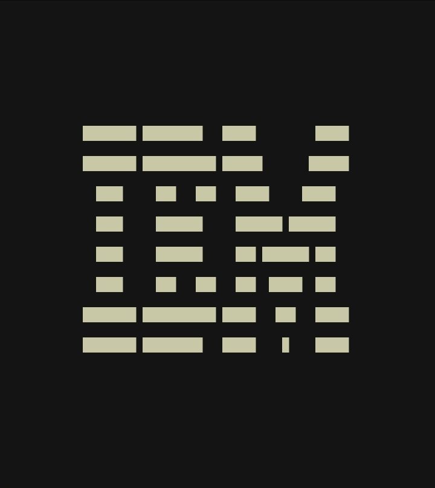
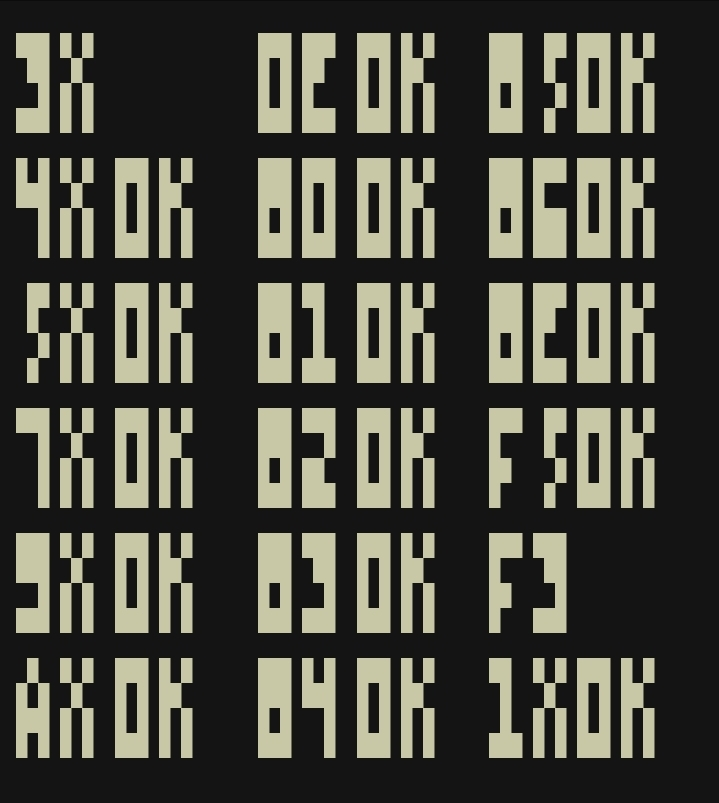

# CHIP-8 Emulator

A terminal-based CHIP-8 emulator written in Zig.


<sub>IBM Logo</sub>

CHIP-8 was created by Joseph Weisbecker in the mid-1970s. It’s a simple programming language with hexadecimal instructions that run on a virtual machine. The language was designed to make it easier to create games for the [COSMAC VIP](https://en.wikipedia.org/wiki/COSMAC_VIP) microcomputer.

This project is an almost complete reimplementation of the CHIP-8 virtual machine. Although, **sound is not implemented yet.**

## Building & Running

```bash
zig build -Doptimize=ReleaseSafe
```

```bash
./zig-out/bin/chip8 <rom file>
```

> [!NOTE]
> zig version `0.15.1` or higher is required. See [release notes](https://ziglang.org/download/0.15.1/release-notes.html) for details.


<sub>Test opcode. Source: [full URL](https://github.com/corax89/chip8-test-rom/blob/6a2cc38be6f5e527221353df024b840a86bc8e5f/test_opcode.8o)</sub>

## Acknowledgements

- **CHIP-8 Wiki:** [https://en.m.wikipedia.org/wiki/CHIP-8](https://en.m.wikipedia.org/wiki/CHIP-8)
- **CHIP-8 Guide by Tobias V. Lütke:** [https://tobiasvl.github.io/blog/write-a-chip-8-emulator](https://tobiasvl.github.io/blog/write-a-chip-8-emulator)
- **Austin Morlan’s CHIP-8 implementation:** [https://austinmorlan.com/posts/chip8_emulator](https://austinmorlan.com/posts/chip8_emulator)
