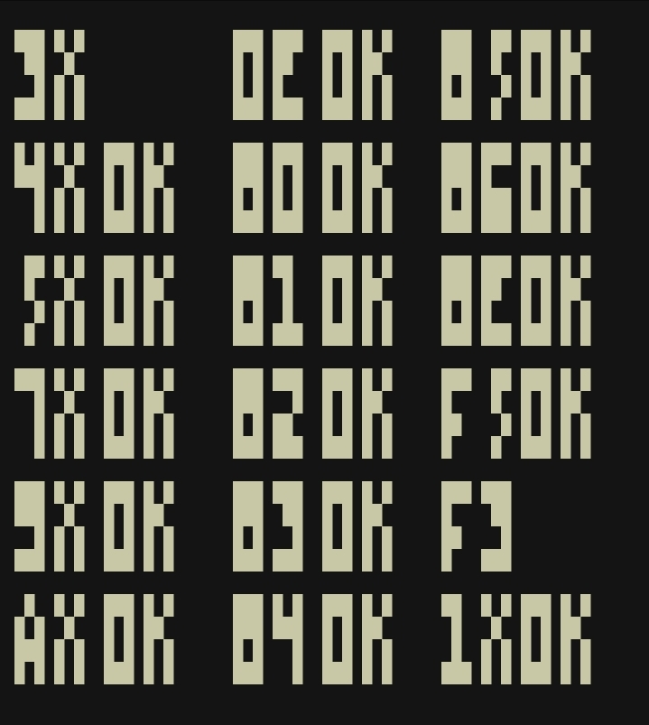

# CHIP-8 Emulator

A terminal-based CHIP-8 emulator written in Zig.

  
<sub>IBM Logo. [Source](https://github.com/kripod/chip8-roms/blob/c723a9ed1205a215c5b1e45e994eb54acc243c9e/programs/IBM%20Logo.ch8)</sub>

  
<sub>Test opcode. [Source](https://github.com/corax89/chip8-test-rom/blob/6a2cc38be6f5e527221353df024b840a86bc8e5f/test_opcode.8o)</sub>

CHIP-8 was created by Joseph Weisbecker in the mid-1970s. It’s a simple programming language with hexadecimal instructions that run on a virtual machine. The language was designed to make it easier to create games for the [COSMAC VIP](https://en.wikipedia.org/wiki/COSMAC_VIP) microcomputer.

This project is an almost complete reimplementation of the CHIP-8 virtual machine. ~~Although sound is not implemented yet.~~

## Building and Running

> [!IMPORTANT]
> Zig version `0.15.1` or higher is required. Since the `0.14.1` release, many Standard Library APIs have been changed, revamped, or removed. See the [release notes](https://ziglang.org/download/0.15.1/release-notes.html) for details.

```bash
zig build -Doptimize=ReleaseSafe
```

Run the emulator:
```bash
./zig-out/bin/chip8 <rom file>
```

## Acknowledgements

- [https://en.m.wikipedia.org/wiki/CHIP-8](https://en.m.wikipedia.org/wiki/CHP-8)  
- [https://tobiasvl.github.io/blog/write-a-chip-8-emulator](https://tobiasvl.github.io/blog/write-a-chip-8-emulator)  
- [https://austinmorlan.com/posts/chip8_emulator](https://austinmorlan.com/posts/chip8_emulator)
